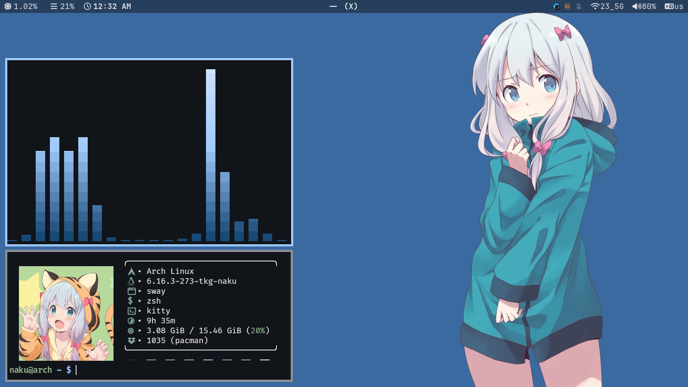
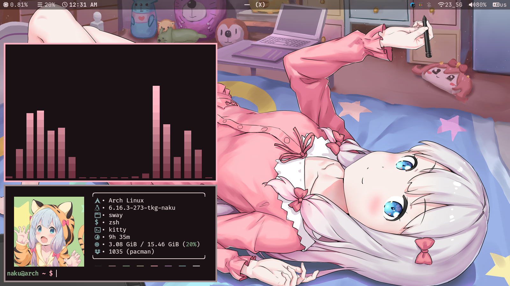
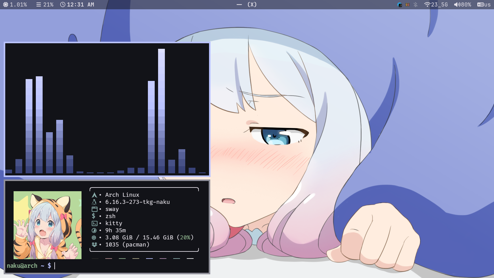
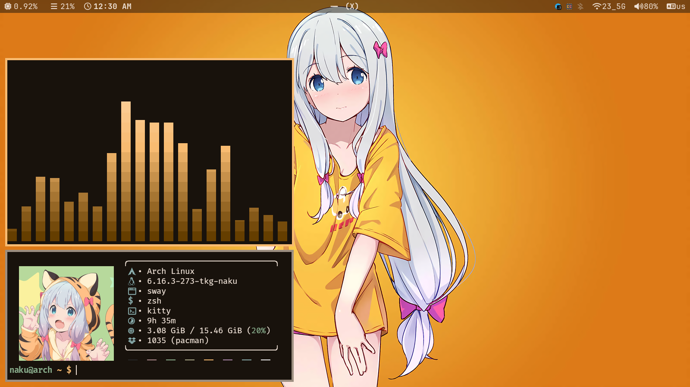
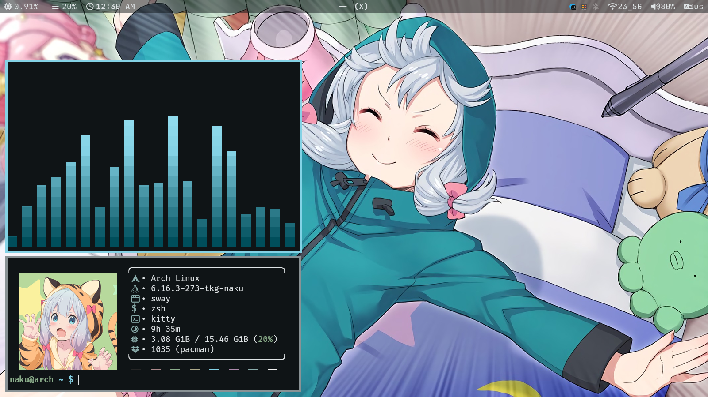

# Миграция на GitLab
по некоторым причинам я решил мигрировать на GitLab: https://gitlab.com/NamakeKuma

# 🎨 My Arch Linux + Sway Dotfiles

✨ *A collection of my personalized configuration files for Arch Linux with Sway Window Manager* ✨

---

## 📸 Screenshots

<div align="center">
  
  
  
  
  
  
  
</div>

<p align="center">
  <em>Desktop overview with waybar and applications</em>
</p>

---

## 📦 Dependencies

### Essential Packages Installation

#### Using `paru` (AUR helper):
```bash
paru -S --needed \
  zsh xorg-xwayland xdg-desktop-portal xdg-desktop-portal-gtk \
  xdg-desktop-portal-wlr wofi wl-clipboard wl-clip-persist wireplumber \
  waybar ttf-jetbrains-mono-nerd ttf-nerd-fonts-symbols \
  ttf-nerd-fonts-symbols-mono thunar thunar-archive-plugin \
  thunar-media-tags-plugin swaybg sway slurp qt6ct qt6-wayland \
  qt5ct qt5-wayland qbittorrent polkit-gnome pipewire-pulse \
  pipewire-jack pipewire-alsa pipewire papirus-icon-theme orage \
  nwg-look noto-fonts noto-fonts-cjk noto-fonts-extra mpv matugen-git \
  kitty imv helvum grim gst-plugin-pipewire gpu-screen-recorder-gtk \
  firefox file-roller fastfetch mako btop bluez blueman adw-gtk-theme \
  cava-git 64gram-desktop-bin walogram-git
```

#### Using `yay` (AUR helper):
```bash
yay -S --needed \
  zsh xorg-xwayland xdg-desktop-portal xdg-desktop-portal-gtk \
  xdg-desktop-portal-wlr wofi wl-clipboard wl-clip-persist wireplumber \
  waybar ttf-jetbrains-mono-nerd ttf-nerd-fonts-symbols \
  ttf-nerd-fonts-symbols-mono thunar thunar-archive-plugin \
  thunar-media-tags-plugin swaybg sway slurp qt6ct qt6-wayland \
  qt5ct qt5-wayland qbittorrent polkit-gnome pipewire-pulse \
  pipewire-jack pipewire-alsa pipewire papirus-icon-theme orage \
  nwg-look noto-fonts noto-fonts-cjk noto-fonts-extra mpv matugen-git \
  kitty imv helvum grim gst-plugin-pipewire gpu-screen-recorder-gtk \
  firefox file-roller fastfetch mako btop bluez blueman adw-gtk-theme \
  cava-git 64gram-desktop-bin walogram-git
```

I use [nakushot](https://github.com/NamakeKuma/nakushot) for taking screenshots 📸

---

## ⚡ Oh My Zsh

Oh My Zsh is a delightful, open source, community-driven framework for managing your Zsh configuration.

<div align="center">

[](https://ohmyz.sh)

</div>

### Installation
```bash
# Using curl
sh -c "$(curl -fsSL https://raw.githubusercontent.com/ohmyzsh/ohmyzsh/master/tools/install.sh)"

# Using wget
sh -c "$(wget https://raw.githubusercontent.com/ohmyzsh/ohmyzsh/master/tools/install.sh -O -)"
```

---

## ⚙️ Configuration Setup

### ZSH Configuration
```bash
# Backup existing configuration
if [ -f ~/.zshrc ]; then
  mv ~/.zshrc ~/.zshrc.backup.$(date +%Y%m%d%H%M%S)
fi

# Install new zshrc
cp zshrc ~/.zshrc

# Set ZSH as default shell
chsh -s "$(which zsh)"
```

### System Configuration
```bash
# Create backup of existing config
if [ -d "$HOME/.config" ]; then
  mv "$HOME/.config" "$HOME/.config.backup.$(date +%Y%m%d%H%M%S)"
fi

# Install new configuration
cp -r config ~/.config
```

---

## 🌍 Environment Variables

Environment variables are stored in the `environment` file. 

📝 *I typically place them at `/etc/environment`, but you can put them wherever works best for your setup!*

---

## ⚠️ Important Notes

### Initial Setup Recommendation
**For first-time configuration installation**, I recommend pressing the `Mod + Shift + W` key combination and selecting any wallpaper. This will synchronize all color schemes to match your chosen wallpaper. 

Since the configuration files include various wallpapers with different color schemes, this step ensures visual consistency and creates a unified aesthetic appearance.

> **Warning**: Replacing system configurations can potentially break your desktop environment or applications. Always maintain backups of your original configurations.

## 🎨 Add the material theme to 64gram

To add the material theme to 64gram: open **Settings > Chat settings > ⋯ (three dots) > Create a theme > mess up the theme**.  
The theme will be saved to **~/.cache/walogram/**

---

### Pre-installation Checklist:
- [ ] Backup important data
- [ ] Verify package compatibility with your system
- [ ] Review configuration files for personal customization
- [ ] Ensure internet connection for package downloads

---

<div align="center">

**Enjoy your new desktop experience!** 🎉

</div>
